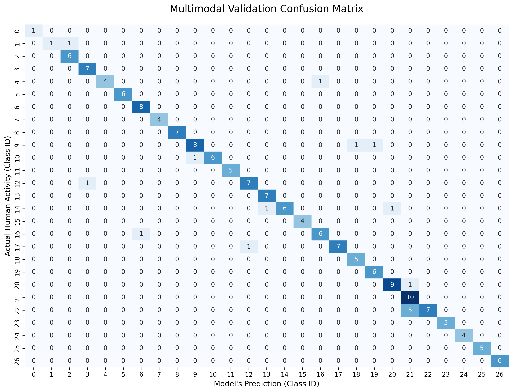
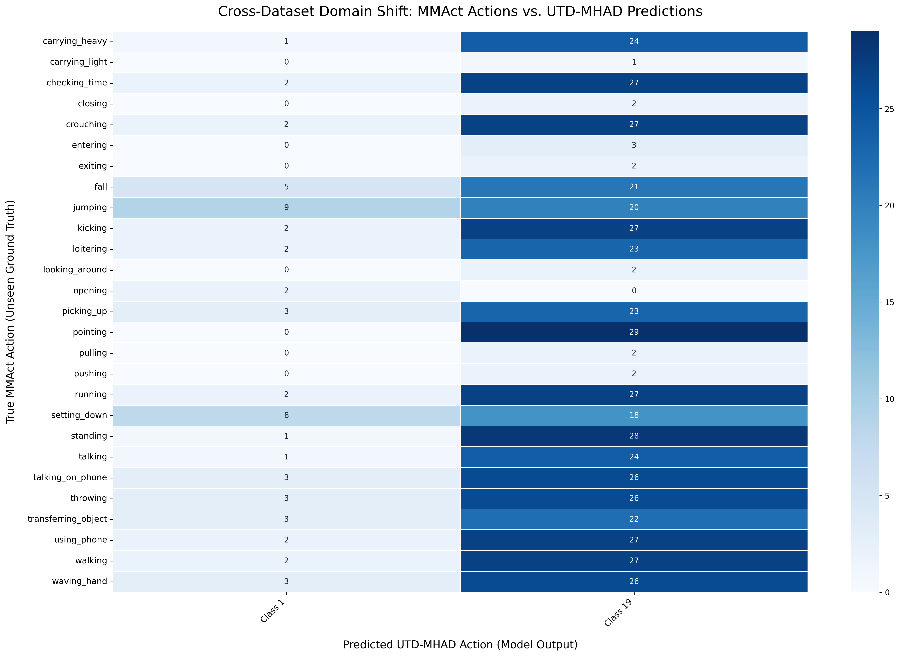

# ⌚ The Limits of Edge-AI Compression: Zero-Shot Cross-Dataset Generalization in Multimodal HAR

**Author:** Makul Swami | **Institution:** IIT Patna (M.Tech in AI)

## 📌 Abstract
This repository contains the official codebase for an ablation study investigating the architectural limits of deploying Multimodal Human Activity Recognition (HAR) models to hyper-compressed edge devices (e.g., smartwatches). 

The research establishes a foundational 27.4M-parameter Hierarchical Multimodal Teacher (Vision + IMU) and systematically evaluates the boundaries of compressing this intelligence into a 2.3M-parameter Edge Student. Through rigorous zero-shot cross-dataset evaluation (training on UTD-MHAD, testing on MMAct), this project empirically proves that while heavy foundational models can survive severe domain shifts, edge-optimized models suffer from catastrophic representational collapse regardless of the compression strategy utilized.

## 💡 Key Contributions & Novelty
While standard HAR literature relies heavily on intra-dataset evaluation, this project isolates the **Zero-Shot Cross-Dataset** barrier. The novelties of this research include:
1. **Empirical Benchmarking:** Establishing a 26.38% unadapted zero-shot baseline for 27-class multimodal HAR using a custom Hierarchical Transformer.
2. **Comprehensive Edge Ablation:** Systematically proving that highly compressed edge models (2.3M params) mathematically lack the representational capacity to survive domain shifts, leading to catastrophic mode collapse.
3. **Evaluation of Compression Limits:** Demonstrating that advanced techniques like Adversarial UDA and Intermediate Feature Matching fail to rescue edge models under strict zero-shot conditions, proving a hard hardware-capacity limit.

## 🏗️ Model Architecture
* **Master Teacher (~27.4M Parameters):** * **Sensor Backbone:** Custom Hierarchical Masked Autoencoder (Transformer) pre-trained via Self-Supervised Learning (SSL) to reconstruct masked 6-axis IMU data.
  * **Vision Backbone:** ResNet50 (stripped of classification head) for spatial/posture embedding.
  * **Fusion:** Dynamic Late-Fusion MLP.
* **Edge Student (~2.3M Parameters):**
  * **Sensor Backbone:** 1D-CNN.
  * **Vision Backbone:** MobileNetV2.

## 🔬 Experimental Phases & Key Discoveries

### Phase 1: The Foundational Baseline (Success)
The heavy Master Teacher was tested under strict zero-shot conditions on the unseen MMAct dataset. 
* **Result:** Achieved an **Aligned Semantic Accuracy of 26.38%** (7x higher than the mathematical random baseline of 3.7%). The model successfully retained multi-modal feature entropy and distributed variance across distinct activity boundaries.

### Phase 2: Standard Knowledge Distillation (Failure)
Compressing the Teacher into the Student using standard logits distillation.
* **Result:** **Mode Collapse (Class 19).** The low-capacity student memorized the source domain's background wall. Upon facing domain shift, it suffered catastrophic representational failure.

### Visualizing the Mode Collapse
*The contrast between the Teacher's feature distribution and the Edge Student's catastrophic failure (Mode Collapse to Class 19) when exposed to an unseen background.*

<p align="center">
  
  
</p>

### Phase 3: Adversarial Unsupervised Domain Adaptation / UDA (Failure)
Implementing a Gradient Reversal Layer (GRL) to force the Student to unlearn domain-specific features.
* **Result:** **Feature Erasure (Mode Collapse to Class 23).** The 2.3M parameter model lacked the capacity to simultaneously balance adversarial domain constraints and complex physical action recognition.

### Phase 4: Intermediate Feature Distillation (Failure)
Forcing the Student to mathematically mimic the Teacher's deep 512-dimensional internal feature map.
* **Result:** **Representational Bottleneck.** The shallow convolutional kernels of the edge model could not map the topological complexity of the Teacher's attention mechanisms.

### Phase 5: Domain-Blind Data Augmentation (Failure)
Applying aggressive Random Erasing, Color Jitter, and IMU Axis Permutation to force the edge model to ignore background memorization.
* **Result:** **Network Underfitting (6.94% Validation Accuracy).** Erasing the background exposed the hard capacity limit of the edge model, proving it mathematically incapable of learning complex physical geometry through heavy noise.

## 📊 Conclusion
This research proves that Zero-Shot Cross-Dataset Generalization is currently unfeasible for hyper-compressed multimodal edge models. Deploying HAR algorithms to wearable devices strictly requires Target-Domain Fine-Tuning (Supervised Few-Shot Learning) on the specific deployment hardware.

## ⚙️ Installation & Data Preparation

**1. Environment Setup:**
```bash
git clone [https://github.com/Makuls/Zero-Shot-Multimodal-HAR.git](https://github.com/Makuls/Zero-Shot-Multimodal-HAR.git)
cd Zero-Shot-Multimodal-HAR
pip install -r requirements.txt